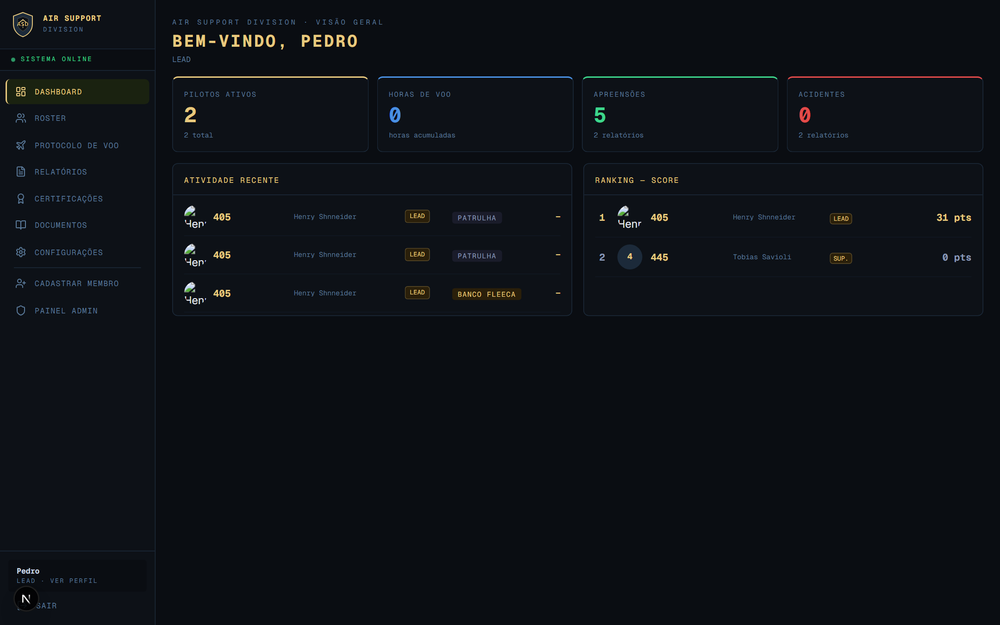
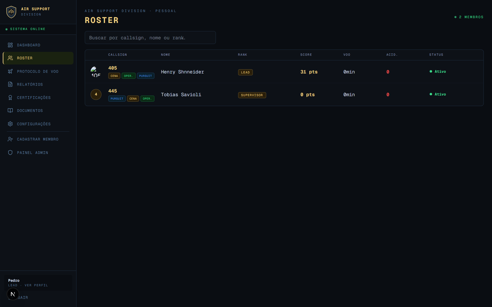
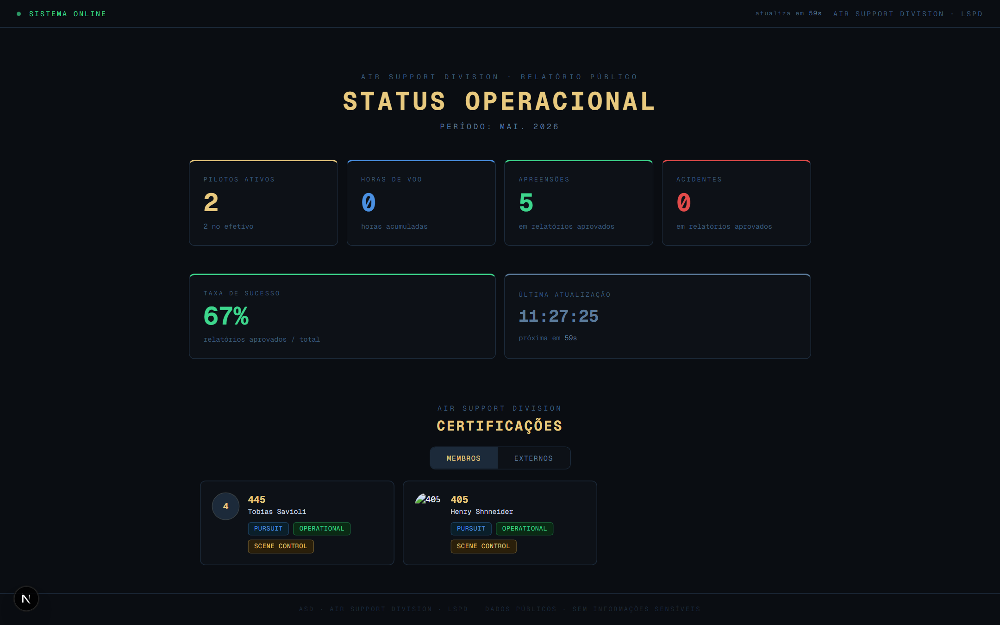
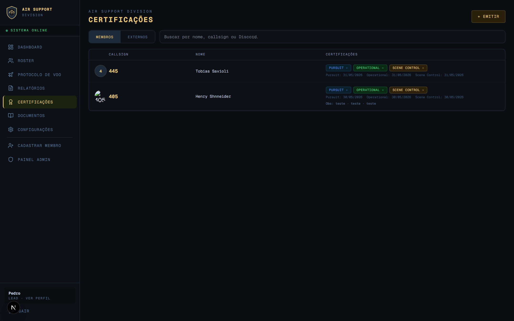
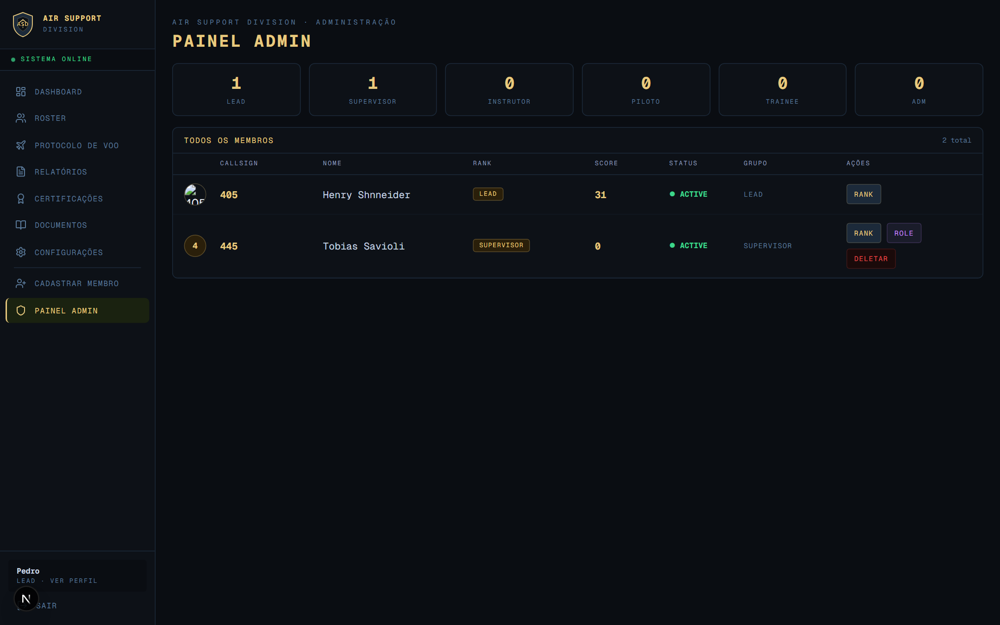

<div align="center">



<h1>Air Ops System</h1>

<p>Sistema de gestão operacional da unidade aérea <strong>ASD (Air Support Division)</strong> — LSPD · FiveM RP</p>

[](https://nextjs.org)
[](https://www.typescriptlang.org)
[](https://react.dev)
[](https://tailwindcss.com)
[](https://vercel.com)
[](https://github.com/phmacieldev/air-ops-system-web/actions)

</div>

---

## Sobre

Frontend do **Air Ops System** — sistema de gestão operacional construído do zero como projeto de portfólio.
Consome a [API REST em Java + Spring Boot](https://github.com/phmacieldev/air-ops-system) e está em produção na Vercel.

O sistema controla pilotos, protocolos de voo, relatórios de missão e certificações técnicas, com autenticação JWT, controle de acesso por hierarquia de 8 ranks e página pública de status com auto-refresh sem necessidade de login.

> Desenvolvido para a *Air Support Division* (ASD), unidade de apoio aéreo de um servidor FiveM GTA RP com temática policial americana (LSPD).

---

## Arquitetura

```
src/
├── app/
│   ├── (auth)/              # Rotas públicas — /login, /register
│   ├── (dashboard)/         # Rotas protegidas com layout compartilhado
│   │   ├── layout.tsx       # Sidebar, header e verificação de auth via useAuth()
│   │   ├── dashboard/       # Métricas e ranking da unidade
│   │   ├── pilots/          # Roster e perfil individual com histórico
│   │   ├── flights/         # Protocolo de voo com paginação
│   │   ├── reports/         # Relatórios com paginação e filtros
│   │   ├── certifications/  # Emissão e histórico de certificações
│   │   ├── admin/           # Painel de gestão de membros
│   │   ├── documents/       # Documentos
│   │   └── settings/        # Alteração de e-mail e senha
│   ├── api/keepalive/       # Route handler — ping ao backend (evita cold start)
│   ├── status/              # Página pública sem autenticação
│   └── layout.tsx           # Root layout com AuthProvider
├── components/              # Componentes de layout e UI reutilizáveis
├── context/                 # AuthContext — estado global de autenticação
├── lib/                     # api.ts (cliente HTTP com cache e retry), utils.ts
├── types/                   # Interfaces TypeScript (Pilot, FlightLog, Role...)
└── proxy.ts                 # Middleware de proteção de rotas — verifica cookie asd_token
```

**Fluxo de autenticação:**
```
Requisição → proxy.ts (middleware) → verifica cookie asd_token
  ├── presente → renderiza a página; layout confirma role via useAuth()
  └── ausente  → redirect /login (sem renderizar nada)
```

---

## Decisões de Design

**Client Components em todas as páginas de dados**
As páginas de roster, voos e relatórios são Client Components com `useEffect` — os dados são buscados no cliente via `api.ts`. A abordagem simplifica o acesso ao token (lido do `localStorage`) e elimina a necessidade de passar credenciais pelo servidor.

**`proxy.ts` como middleware de proteção de rotas**
O middleware verifica o cookie `asd_token` antes de qualquer renderização. Rotas protegidas retornam 307 redirect para usuários sem token — o conteúdo nunca é processado ou enviado ao cliente. As rotas `/login`, `/register`, `/status` e `/api/*` são excluídas do matcher.

**JWT em `localStorage` + cookie não-httpOnly**
O token vive em dois lugares: `localStorage` (para leitura pelo `api.ts` em cada requisição) e cookie `asd_token` com `SameSite=Lax` (para que o middleware de borda possa verificar sem acesso ao JavaScript). Auto-refresh acontece automaticamente quando o token vai expirar em menos de 2 horas.

**`api.ts` centralizado com cache TTL e retry em 401**
Todas as chamadas passam por um único cliente que injeta `Authorization: Bearer <token>`, implementa cache TTL opcional no cliente (evita refetch em navegação entre páginas) e retenta com token renovado em caso de 401.

**Página `/status` com polling por `setInterval`**
Em vez de WebSockets ou SSE (limitados no free tier), a página usa `setInterval` de 60 segundos com countdown visual — sem dependências extras, funciona em qualquer plano de hospedagem.

**`/api/keepalive` para evitar cold start**
O backend no Render hiberna após 15 min de inatividade. O route handler `/api/keepalive` existe como endpoint de ping, acionado externamente pelo UptimeRobot a cada 5 minutos — solução compatível com o plano Hobby da Vercel, que não suporta cron jobs nativos.

---

## Screenshots

| Roster com badges de certificação | Status Operacional |
|---|---|
|  |  |

| Painel de Certificações | Painel Admin |
|---|---|
|  |  |

---

## Funcionalidades

- **Autenticação JWT** — login, sessão persistente, proteção de rotas por role
- **Hierarquia de ranks** — LEAD, ADM, SUPERVISOR, INSTRUCTOR, PILOT (SENIOR/PLENO/STANDARD), TRAINEE com permissões distintas
- **Dashboard** — métricas da unidade, atividade recente e ranking de score em tempo real
- **Roster** — lista de pilotos com badges de certificação, score, status e busca por callsign/nome/rank
- **Perfil do piloto** — histórico de voos, relatórios, estatísticas e edição de dados pessoais
- **Protocolo de voo** — registro de missões com tipo, hora de início/fim e paginação
- **Relatórios** — criação, aprovação/rejeição e histórico paginado com filtros
- **Certificações** — emissão para membros e externos, com histórico por data
- **Página /status** — painel público com auto-refresh a cada 60s
- **Sino de notificações** — badge no header com contagem de protocolos e relatórios pendentes (visível para LEAD/ADM/SUPERVISOR), atualizado a cada 60s
- **Painel Admin** — gestão de membros, edição de perfil (callsign, status, foto), promoção de rank/role e remoção com confirmação por callsign
- **Configurações** — alteração de e-mail e senha com toggle de visibilidade

---

## Stack

| Camada | Tecnologia |
|---|---|
| Framework | Next.js 16 (App Router, Turbopack) |
| Linguagem | TypeScript 5 |
| Estilização | Tailwind CSS 4 |
| Componentes | shadcn/ui + Base UI |
| Ícones | Lucide React |
| Deploy | Vercel |
| CI | GitHub Actions |

---

## Como Rodar Localmente

**Pré-requisitos:** Node.js 20+ e o [backend](https://github.com/phmacieldev/air-ops-system) rodando em `localhost:8080`.

```bash
git clone https://github.com/phmacieldev/air-ops-system-web
cd air-ops-system-web

npm install

cp .env.example .env.local
# edite .env.local se necessário

npm run dev
```

Acesse `http://localhost:3000`.

---

## Variáveis de Ambiente

| Variável | Descrição | Padrão local |
|---|---|---|
| `NEXT_PUBLIC_API_URL` | URL base da API REST | `http://localhost:8080` |

---

## Deploy — Vercel

1. Conecte o repositório no [Vercel](https://vercel.com)
2. Adicione a variável de ambiente `NEXT_PUBLIC_API_URL` apontando para o backend no Render
3. Push na `main` dispara deploy automático

---

## Próximos Passos

- [ ] Testes de componentes com Testing Library + Vitest
- [ ] Notificações internas de mudança de status (relatório aprovado/rejeitado)
- [ ] Gráfico de evolução mensal dos KPIs na página `/status`
- [ ] Exportar relatórios em PDF/CSV
- [ ] Refresh token automático — interceptar 401 e renovar antes de redirecionar para login
- [ ] Migrar token de `localStorage` para cookie `httpOnly` — elimina vetor de ataque XSS

---

## Repositório do Backend

API REST que alimenta este frontend: [phmacieldev/air-ops-system](https://github.com/phmacieldev/air-ops-system)
